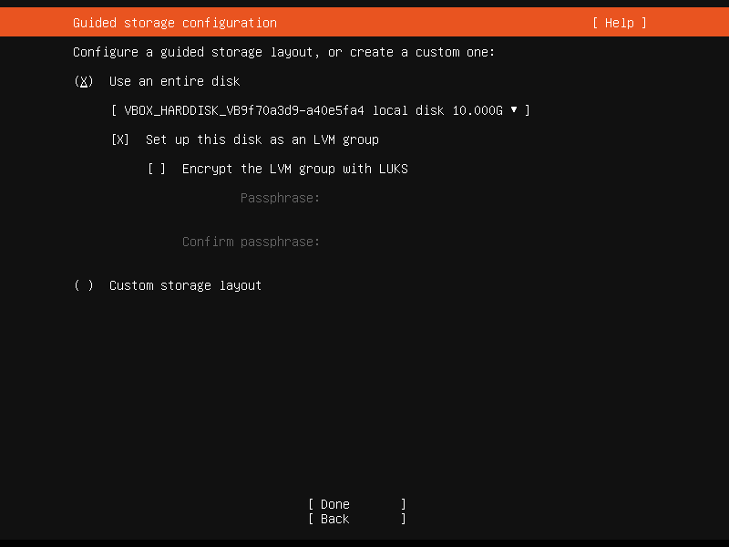
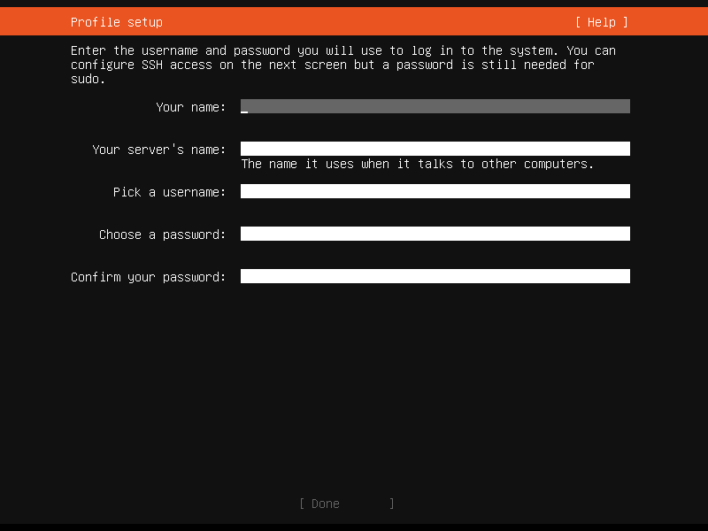
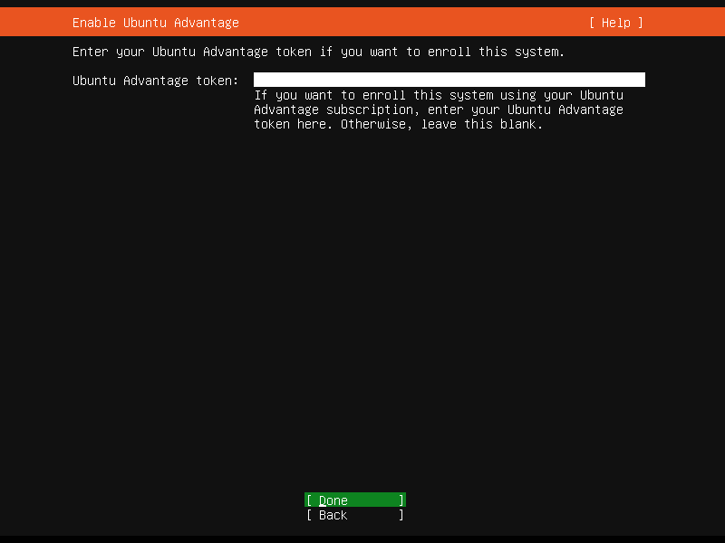
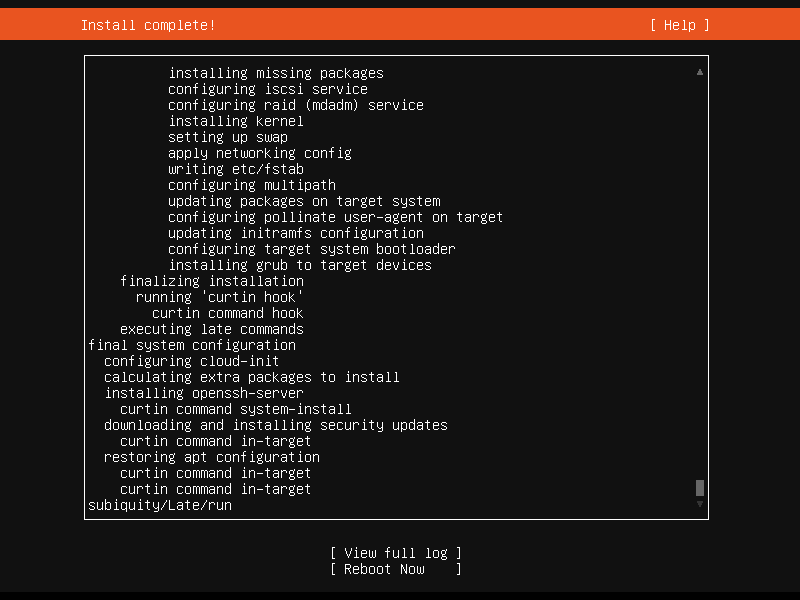

# ubuntu-20.04.4-server安装与基本配置

## 问题产生背景

由于众所周知的[原因](https://blog.centos.org/2020/12/future-is-centos-stream/)，业务需要从centos迁移到其它操作系统了；本人还是觉得非常可惜，这么久以来这个系统一直是大家的首选，其实已经用习惯了

Ubuntu-server成为了本次迁移的首选，本文基于[ubuntu-20.04.4-server](https://ubuntu.com/download/server)从安装到配置进行总结

## 1、安装

点击上分系统链接进入官网镜像下载界面，下载完成后根据自己实际使用方式选择安装

### 1.选择语言


### 2.设置键盘


### 3.配置网络

如果你所处的网络没有DHCP，需要静态IP；在此处键入对应值即可


### 4.配置代理

没有需求可直接跳过


### 5.设置源地址

这个可以配置阿里云(http://mirrors.aliyun.com/ubuntu/)，下载加速


### 6.配置磁盘分区

一般默认即可，如果有特殊需求自行设置




### 7.配置用户名和密码



### 8.输入Ubuntu Advantage，一般跳过



### 9.安装OpenSSH


#### 10.选择需要插件


### 11.等待安装


### 12.出现Reboot后选择并重启



### 13.重启成功后即可登陆使用

参考配置免密登录


## 2、系统时区修改

安装完后的系统默认是UTC时区，需要修改到国内

### 通过命令设置：tzselect


按照图片依次执行完后，发现时区任然没有更改

```shell
ubuntu@ubuntu:~$ date -R
Thu, 03 Mar 2022 03:25:35 +0000
```

### 复制时间文件

```shell
ubuntu@ubuntu:~$ sudo cp /usr/share/zoneinfo/Asia/Shanghai /etc/localtime 
[sudo] password for ubuntu: 
ubuntu@ubuntu:~$ date -R
Thu, 03 Mar 2022 11:27:40 +0800
```

执行完成后时间显示正常

## 3、修改DNS

国内目前DNS污染严重，修改DNS可以有效解决部分网络问题

使用nslookup命令查看当前DNS:

```she
ubuntu@ubuntu:~$ nslookup qq.coom
Server:		127.0.0.53
Address:	127.0.0.53#53
```

目前版本Ubuntu默认DNS为127.0.0.53

**首先修改 /etc/systemd/resolved.conf 文件，在其中添加dns信息，例如：**

`DNS=8.8.8.8 114.114.114.114`

然后退出保存

**然后以root身份在ubuntu终端中依次执行如下命令：**

```shell
systemctl restart systemd-resolved
systemctl enable systemd-resolved
 
mv /etc/resolv.conf  /etc/resolv.conf.bak
ln -s /run/systemd/resolve/resolv.conf /etc/
```

再查看nslookup:

```shell
ubuntu@ubuntu:~$ nslookup qq.com
Server:		114.114.114.114
Address:	114.114.114.114#53
```

